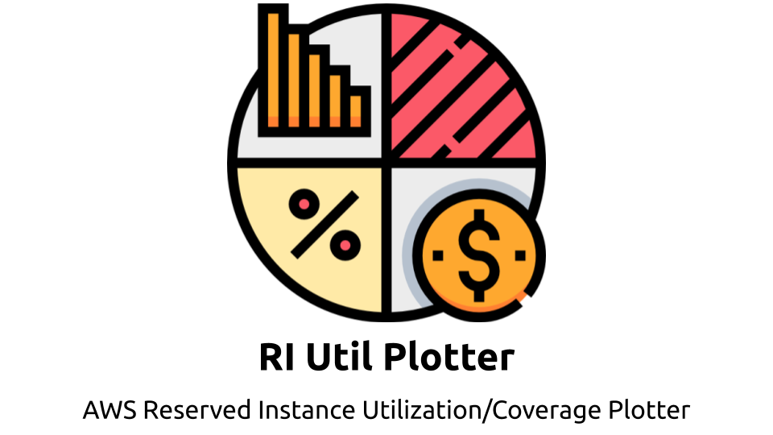

[](https://godoc.org/github.com/kenzo0107/ri-utilization-plotter)
[](https://raw.githubusercontent.com/kenzo0107/ri-utilization-plotter/master/LICENSE)
[](https://goreportcard.com/report/github.com/kenzo0107/ri-utilization-plotter)
[](https://codecov.io/gh/kenzo0107/ri-utilization-plotter)

This project provides an AWS Lambda application that created and deployed by Serverless Framework for the following purpose:

* Plot below metrics of your AWS Accounts to Datadog using cross-account access by AssumeRole
  - AWS Reserved Instance Utilization
  - AWS Reserved Instance Coverage

## Preparation

### Set Role

Change `Role` to your role arn in template.yaml.

To assume a role from a different account, your AWS account must be trusted by this role.

```
arn:aws:iam::123456789012:role/original
```

In other account, create and add the above role arn to below role's trusted entity.

```
arn:aws:iam::<cross account id>:role/stsMonitor
```

Change below line if you want to change role name in cross account

* pkg/awsapi/sts.go
```golang
fmtRoleArn         = "arn:aws:iam::%s:role/stsMonitor"
```

### Set SSM Parameter store with description in account which the assume role belongs to

set in region: us-east-1 because AWS CostExplorer API works in region us-east-1.

* datadog_api_key
* datadog_app_key

## Invoke Lambda Function in Local

```sh
make local-invoke
```

## Deploy Lambda Function 

```sh
make deploy
```

## Invoke Lambda Function

```sh
aws lambda invoke --function-name ri-utilization-plotter --log-type Tail out.log
```

## LICENSE

[MIT License](https://github.com/kenzo0107/ri-utilization-plotter/blob/master/LICENSE)

## Note

Icon made by bqlqn from [www.flaticon.com](https://www.flaticon.com)